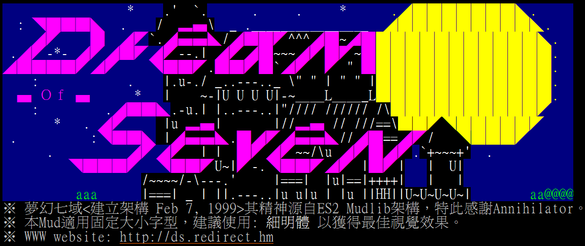

# mudos-game-ds

## IP 210.59.236.38 7000

## [玩家手冊 (User Manual)](https://github.com/zwshen/mudos-game-ds/tree/master/player-manual)

## [遊戲開發資料 (materials)](https://github.com/zwshen/mudos-game-ds/tree/master/ReferenceMaterials)

## [巫師手冊(Wizard Mnaual)](https://github.com/zwshen/mudos-game-ds/tree/master/Wizard)
  - LPC函式說明
  - LPC教程完全合集
  - LPC精講
  - MudOS精講
  - 巫師講授

## Recommended telnet tools
- Windows - [zmud, Zugg's MUD Client](http://www.zuggsoft.com/page.php?file=zmud/zmudinfo.htm)
- Mac - [mudlet](https://www.mudlet.org/)
- Liuux - [Tintin++ ](https://tintin.mudhalla.net/)
